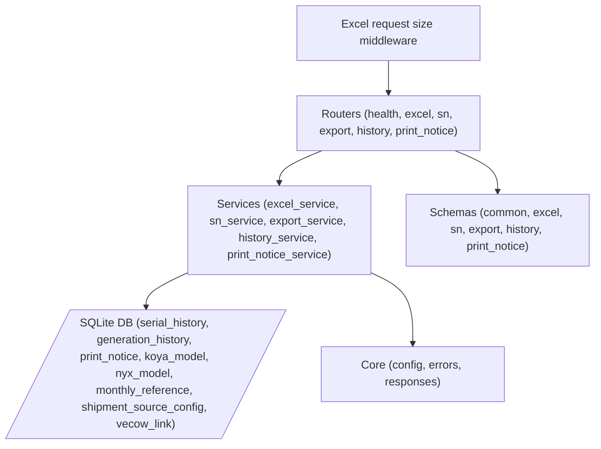

# SN-GENERATOR 後端代碼地圖 (Back-End Code Map)

**Version:** 0.3.79
**Last Updated:** 2026-09-18

---

> v0.3.44 的 MO 雙預覽與選取為純前端流程，後端 API、Schema、Service 與資料庫結構均無變更。

> v0.3.45 未變更 API 契約；僅將 SQLite 預設位置改為不受啟動目錄影響的絕對路徑，並同步 Docker volume 至 `/app/data`。

## 1. 後端架構圖 (Architecture Diagram)

## 2. 檔案概覽 (File Overview)

| Path | Line Count | Description |
| :--- | :--- | :--- |
| `main.py` | - | App entry point and FastAPI setup |
| `routers/*` | - | Route definitions |
| `services/*` | - | Business logic implementations |
| `schemas/*` | - | Pydantic models for request/response validation |
| `core/*` | - | App configuration and error handling |

## 3. API 端點完整映射 (Complete API Endpoint Map)

除 `/api/health` 外，下列會執行 Excel、SQLite、檔案或同步匯出工作的 handler 均宣告為普通 `def`，由 FastAPI 自動排入 Thread Pool，避免凍結 Event Loop。`/api/health` 不執行 I/O，保留 `async def`。

| # | Method | Path | Router | Handler |
|---|---|---|---|---|
| 1 | `POST` | `/api/excel/parse` | `excel.py` | `parse_excel` |
| 2 | `GET` | `/api/excel/load-default` | `excel.py` | `load_default_excel` |
| 3 | `GET` | `/api/excel/load-source` | `excel.py` | `load_source_excel` |
| 4 | `POST` | `/api/export` | `export.py` | `export_excel` |
| 5 | `GET` | `/api/health` | `health.py` | `health_check` |
| 6 | `GET` | `/api/history/{customer}` | `history.py` | `get_history` |
| 7 | `POST` | `/api/history/upsert` | `history.py` | `upsert_history` |
| 8 | `POST` | `/api/history/reset` | `history.py` | `reset_history` |
| 9 | `GET` | `/api/koya-model` | `koya_model.py` | `list_koya_models` |
| 10 | `POST` | `/api/koya-model/upsert` | `koya_model.py` | `upsert_koya_model` |
| 11 | `DELETE` | `/api/koya-model` | `koya_model.py` | `delete_koya_model` |
| 12 | `GET` | `/api/monthly-reference/{customer}` | `monthly_reference.py` | `list_monthly_references` |
| 13 | `POST` | `/api/monthly-reference/{customer}/upsert` | `monthly_reference.py` | `upsert_monthly_reference` |
| 14 | `DELETE` | `/api/monthly-reference/{customer}` | `monthly_reference.py` | `delete_monthly_reference` |
| 15 | `GET` | `/api/nyx-model` | `nyx_model.py` | `list_nyx_models` |
| 16 | `POST` | `/api/nyx-model/upsert` | `nyx_model.py` | `upsert_nyx_model` |
| 17 | `DELETE` | `/api/nyx-model` | `nyx_model.py` | `delete_nyx_model` |
| 18 | `GET` | `/api/print-notice` | `print_notice.py` | `list_print_notices` |
| 19 | `POST` | `/api/print-notice/upsert` | `print_notice.py` | `upsert_print_notice` |
| 20 | `DELETE` | `/api/print-notice` | `print_notice.py` | `delete_print_notice` |
| 21 | `GET` | `/api/shipment-refresh` | `shipment_refresh.py` | `get_shipment_refresh_status` |
| 22 | `POST` | `/api/shipment-refresh/run` | `shipment_refresh.py` | `run_shipment_refresh` |
| 23 | `POST` | `/api/shipment-sources/preview` | `shipment_source.py` | `preview_shipment_source` |
| 24 | `POST` | `/api/shipment-sources` | `shipment_source.py` | `create_shipment_source` |
| 25 | `GET` | `/api/shipment-sources` | `shipment_source.py` | `list_shipment_sources` |
| 26 | `PUT` | `/api/shipment-sources/{source_key}` | `shipment_source.py` | `update_shipment_source` |
| 27 | `POST` | `/api/shipment-sources/{source_key}/reset` | `shipment_source.py` | `reset_shipment_source` |
| 28 | `POST` | `/api/sn/generate` | `sn.py` | `generate_sn` |
| 29 | `GET` | `/api/sn/fzg/status` | `sn.py` | `get_fzg_status` |
| 30 | `POST` | `/api/sn/fzg/reset` | `sn.py` | `reset_fzg_serial` |
| 31 | `GET` | `/api/vecow-link` | `vecow_link.py` | `get_vecow_link` |
| 32 | `PUT` | `/api/vecow-link` | `vecow_link.py` | `save_vecow_link` |

JSON routes use typed `ApiResponse[T]`; `/api/export` is a streamed file.

## 4. 服務層詳情 (Service Layer Details)

### ExcelService
- **Class name:** `ExcelService`, **Singleton instance:** `excel_service`
- **Public methods:** `load_from_default_path`, `parse`
- **DB tables accessed:** -
- **Business logic summary:** Special handling includes HMG columnar parsing, BNG sanitization, and column alias resolution.

### SnService
- **Class name:** `SnService`, **Lifecycle:** lifespan 建立 `SnService(history_service)` 並由 Depends 注入
- **Public methods:** `generate` (with 7-customer dispatch)
- **DB tables accessed:** `serial_history`, `generation_history`
- **Business logic summary:**
  - yingbang: `{po}1{4-digit}`
  - lunfei: `106{WW}62{5-digit}`
  - others: accept external serials

### ExportService
- **Class name:** `ExportService`, **Singleton instance:** `export_service`
- **Public methods:** `export`
- **DB tables accessed:** -
- **Business logic summary:** Uses `EXPORT_HEADERS` config for each customer for dynamic workbook generation.

### HistoryService
- **Class name:** `HistoryService`, **Lifecycle:** FastAPI lifespan 建立並透過 `Depends` 注入
- **Public methods:** `initialize`, `list_entries`, `get_last_serial`, `list_generation_records`, `upsert_entry`, `reset_entry`
- **DB tables accessed:** `serial_history`, `generation_history`
- **Business logic summary:** SQLite 啟用 WAL；寫入先執行 `BEGIN IMMEDIATE` 取得 write lock；`increment > 0` 再以 `UPSERT ... RETURNING last_serial` 建立或遞增計數器，並由回傳終點反推 `previous`，可跨 Worker 序列化交易。

### PrintNoticeService
- **Class name:** `PrintNoticeService`, **Lifecycle:** FastAPI lifespan 建立並透過 `Depends` 注入
- **Public methods:** `initialize`, `list_entries`, `upsert_entry`, `delete_entry`
- **DB tables accessed:** `print_notice`
- **Business logic summary:** Manages printing notification data.

## 5. Schema 完整規格 (Schema Details)

Pydantic models definition with all fields and types inside `schemas/` folder mapping to endpoints. JSON API 使用 `ApiResponse[T]`，每條路由以具體 data model 產生 OpenAPI schema。

## 6. 資料庫結構 (Database Schema)

8 tables implemented via SQLite:
- `serial_history`: Tracks the latest base serial for iteration.
- `generation_history`: Audit trail for generated outputs.
- `print_notice`: Temporary state for generated notices ready to print.
- `koya_model`, `nyx_model`: 型號主檔。
- `monthly_reference`: KOYA PO／NYX LOT 月份對照。
- `shipment_source_config`: 九個來源設定。
- `vecow_link`: 超恩 BIOS/FW 分享網址。

## 7. 組態設定 (Configuration)

Settings dataclass in `core/config.py`:
- `app_name`
- `api_prefix`
- `db_path`
- `allowed_customers`
- `cors_allowed_origins`（來源為 `CORS_ALLOWED_ORIGINS`；禁止 `*`）
- `max_excel_upload_bytes`（來源為 `MAX_EXCEL_UPLOAD_BYTES`；預設 20 MiB）
- `max_excel_uncompressed_bytes`（來源為 `MAX_EXCEL_UNCOMPRESSED_BYTES`；預設 100 MiB）
- `default_excel` paths

`db_path` 預設解析為 `backend/data/sn_generator.db` 的絕對路徑，不受 current working directory 影響；`DB_PATH` 可覆寫，若提供相對路徑則以 `backend/` 為基準。

## 8. 錯誤處理 (Error Handling)

- Unified `ApiResponse` error format.
- Global exception handlers: `AppError`, `ValidationError`, `HTTPException`, `Exception`.
- 未預期例外對外僅回傳固定 `INTERNAL_ERROR`，完整 traceback 由 `logger.exception` 記錄。
- Complete error code list (18+ codes) mapping API logic exceptions to user-friendly messages.

## 9. 端到端資料流 (End-to-End Data Flows)

1. **Parse Excel:** `Client` -> `Router` -> `ExcelService` -> `Response`
2. **Generate SN:** `Client` -> `Router` -> `SnService` -> `HistoryService atomic range reservation` -> `DB` -> `SN formatting` -> `Response`
3. **Export Excel:** `Client` -> `Router` -> `ExportService` -> `Response`
4. **History management:** `Client` -> `Router` -> `HistoryService` -> `DB` -> `Response`
5. **Print notice management:** `Client` -> `Router` -> `PrintNoticeService` -> `DB` -> `Response`

## 10. 部署架構 (Deployment)

- **Dockerfile:** `python:3.12-slim`, `uvicorn`
- **docker-compose.yml:** `api` + `nginx` services
- **Setup:** Volume mounts for DB/Excels, network config for proxying.
- **CORS:** Docker 預設 `CORS_ALLOWED_ORIGINS=http://localhost:8080`；其他部署網域必須明確加入逗號分隔清單。

## 11. P0 回歸測試 (P0 Regression Tests)

- `backend/tests/test_p0_regressions.py`
- 以 4 個共用同一 SQLite 檔的服務實例並行保留 40 個區間（每段 5 筆），驗證 200 個流水號唯一且連續。
- 驗證允許來源會取得 CORS response header、未列入來源不會取得，且 `CORS_ALLOWED_ORIGINS=*` 會被拒絕。

## 12. P1 穩定性回歸測試 (P1 Stability Tests)

- `backend/tests/test_p1_regressions.py`
- 驗證 Excel、匯出、History、SN、Print Notice 等 10 條同步 I/O 路由皆不是 coroutine handler，確保進入 FastAPI Thread Pool。
- 驗證純記憶體 `/api/health` 仍為 async handler。
- 驗證預設 DB 路徑不受 current working directory 影響，並涵蓋 `DB_PATH` 絕對／相對路徑覆寫。
- `backend/tests/test_p1_security_regressions.py` 驗證 500 資訊不外洩、宣告與實際 request/file 大小限制、XLSX 解壓總量限制及下載檔名控制字元清理。

## 2026-09-14 現況同步

- 出貨更新：首頁「更新資料」啟動背景合併程式，每秒輪詢進度，成功後重新載入總表；最後更新時間取自檔案 mtime，以台北時間顯示。
- 合併來源包含營邦、倫飛、超恩、KOYA、富弘年、勤誠；`load-source` 允許自訂來源與內建富弘年工作表，富弘年僅供首頁搜尋／預覽；勤誠另走 FZG 載入與生成流程。
- KOYA 型號保存 Model／PN／full PN；NYX 保存 Model／PN。PO／LOT 分別由月份對照維護；NYX 目前只有主檔維護，未接入出貨查詢與匯出。
- 資料來源設定保存於 SQLite，支援九個來源的路徑及適用的工作表、檔名關鍵字、回溯檔案數；重設恢復當前環境變數或程式預設值。
- 後端服務由 FastAPI lifespan 初始化並透過 Depends 注入；Customer Enum、ApiResponse[T]、輸入上限、JSON logging、WAL 與 SQLite 交易已實作。
- Docker 資料庫掛載為 /app/data；網路磁碟掛載為 /mnt/netdisk。Linux systemd 提供獨立資料目錄與資料庫備份／修復腳本。
- 本次同步依據目前工作樹（包含未提交及新增檔案），不代表已部署。主檔與來源維護已從 app.js 抽離；多客戶查詢／匯出協調及 Docker 非 root 使用者仍待完成。

### 新增服務與檔案對應

| 功能 | Router／Schema | Service | 儲存或執行位置 |
|---|---|---|---|
| KOYA 型號 | `koya_model.py` | `KoyaModelService` | `koya_model` |
| NYX 型號 | `nyx_model.py` | `NyxModelService` | `nyx_model` |
| PO／LOT 月份 | `monthly_reference.py` | `MonthlyReferenceService` | `monthly_reference` |
| 總表更新 | `shipment_refresh.py` | `ShipmentRefreshService` | 記憶體任務 + `tools/shipment_merge.py` |
| 來源設定 | `shipment_source.py` | `ShipmentSourceService` | `shipment_source_config` |

`core/dependencies.py` 從 `request.app.state` 取得服務，測試可用 dependency override。服務建構不再自動建表，必須執行 lifespan 或直接呼叫 initialize。`core/customers.py` 集中 Customer Enum 與外部序號客戶集合；NYX 不在六客戶序號 Enum 中。

`core/logging.py` 設定 JSON logging；HTTP middleware 記錄 request_id、method、path、status_code、duration_ms 並回傳 X-Request-ID。SQLite 連線採 30 秒 timeout，history 設 busy_timeout=30000，連線使用 closing 確保釋放。

`StrictBaseModel` 拒絕額外欄位；SN qty 為 1～100000，provided_serials 最多 100000 筆。來源 path 最長 1000、sheet_rule 最長 1000、file_rule 最長 300、recent_files 為 1～50。來源九個 key：yingbang、lunfei、bng、bng_fcst、bios、koya、koya_model、dcg、fzg。資料库值優先於初始化預設值，環境變數變更後需重設來源才套用。

更新任務僅在單一服務實例阻止重複執行，部署更新入口應使用單 worker。合併輸出策略、設定優先順序與 Docker/systemd 步驟見 [架構](architecture.md)。

### 超恩 BIOS/FW 分享連結（2026-09-14 現況）

`GET /api/vecow-link` 讀取、`PUT /api/vecow-link` 儲存 `{ "url": "https://…" }`；空白移除，最長 2000 字元，只接受無帳密的有效 HTTP(S) 網址。`VecowLinkService` 使用 SQLite `vecow_link` 單列（id=1），lifespan 初始化後由 router 從 app.state 取得。`js/modules/vecowLink.js` 管理維護表單、載入與連結顯示；首頁僅命中超恩時顯示，超恩工作區亦有入口，未設定時隱藏，新頁開啟使用 noopener noreferrer。此分享網址獨立於合併器 BIOS Excel 檔案路徑。維護入口以 Ctrl+Shift+D 切換顯示。

## v0.3.61 現況補充（2026-09-14）

本次以目前未提交工作樹核對，保留之前的修改紀錄。新增泉影 DEG 獨立生成面板、三種編碼規格、日期帶入、整批複製、Excel 下載與生成歷史；新增深色／淺色／彩色外觀選擇。後端允許七個 customer（原六客戶加 deg），前端 CUSTOMERS registry 與聚合搜尋仍為原六客戶，DEG 由獨立面板操作；NYX 仍僅提供主檔與月份維護。API 仍為 27 組 Method／Path，資料庫仍為八個表，DEG 重用 SN／export／history API 與既有歷史表。

### DEG 後端新增映射

- core/customers.py 新增 Customer.DEG；core/config.py 的 allowed_customers 納入 deg。
- schemas/sn.py 新增 DegOptions：spec、product、date_code、year_last、week、weekday、start_serial（預設 1，1～99999）；GenerateSnRequest.deg 為選填，customer=deg 時服務要求有效設定。
- services/deg_service.py 的 build_deg_serials(options, qty) 驗證三種格式與總量上限，回傳序號清單及 spec:prefix 歷史 key。
- services/sn_service.py 的 DEG 分支在驗證成功後呼叫 HistoryService.upsert_entry，保存累計數量與首尾區間；不自動接續操作員指定的起號。
- services/export_service.py 新增 deg 的 SN 工作表／SN 單欄，沒有新路由或資料表。
- services/excel_service.py 共用 _cell_to_text：None 轉空白，整數型浮點轉整數文字，保留數值 0，供標題、列資料與欄式解析共用，避免 0 消失與編碼多出 .0。
- tests/test_deg.py 覆蓋三規格、歷史、XLSX 與無效輸入不寫入；test_deg_api.py 覆蓋生成／歷史／匯出及 Carton 溢位 API。

## v0.3.79 工作樹現況（2026-09-18）

本版文件依目前未提交工作樹同步。現況包含可配置來源規則五階段、自訂來源建立與預覽、舊客戶比較遷移、DEG 編碼、勤誠 FZG 客序／MAC，以及富弘年 `dcg` 首頁搜尋。所有通用來源在更新總表後自動加入首頁工單／MO 搜尋，並使用超恩式摘要、分類卡片、預覽／原始資料頁籤與複製操作，不需新增客戶分支。前端已將主檔維護與來源維護分別抽至 `masterDataMaintenance.js`、`sourceMaintenance.js`。後端 Customer Enum 為 8 個值；現行 API 共 32 組 Method／Path，SQLite 共 8 張表。

部署邊界：`deploy/shipment-release.json` 現為 0.3.79，本機執行 `shipment_check.py --check` 回傳 `errors: []`，清單內檔案雜湊、MIME、模組與來源設定檢查通過。此結果僅代表目前工作區自檢通過；本機未連線正式網路磁碟，亦未驗證正式伺服器部署、服務帳號權限或真實客戶資料比較。

驗證狀態（2026-09-18）：`npm test` 的 7 組前端回歸全部通過（含 Playwright 來源規則瀏覽器流程）；後端完整測試為 `114 passed`；74 個 Python 檔語法解析通過；部署清單自檢無錯誤。

### v0.3.79 後端檔案與資料流

- `tools/source_rules.py`：version 1 驗證、I01–I07、共用讀取與預覽樣本。
- `tools/source_advanced.py`：儲存格補值、對照、拆列與計算；`source_mail.py`／`mail_tables.py`：EML／MSG 與 HTML 表格。
- `tools/source_presets.py`：營邦／倫飛／富弘年／勤誠候選範本；`source_migration.py`：新舊逐次比較與 fallback；`shipment_check.py`：唯讀部署／MIME／雜湊／權限檢查。
- `services/shipment_source_service.py`：建立自訂來源、保存 rules/search 欄、內建候選與唯讀來源讀取；使用 `SHIPMENT_CUSTOM_SOURCES`、`SHIPMENT_BUILTIN_RULE_SOURCES` 傳給合併子程序。
- `services/fzg_serial_service.py`：勤誠料號分類、週 key、客序／MAC 保留、狀態與重設；`HistoryService` 新增有上下限的 `reserve_range` 及 `set_last_serial`。
- `/api/excel/load-source` 載入已保存自訂來源或內建 `dcg` 在總表的同名工作表；`/api/excel/load-default?customer=deg` 依唯一 DEG 綁定解析。缺來源／工作表／指定欄名時明確失敗，不回退其他來源。

`shipment_source_config` 仍是一張表，啟動時以 ALTER TABLE 相容補上 `label`、`path_kind`、`rules_json`、`search_customer`、`work_order_column`、`customer_keywords`，並以 partial unique index 保證 DEG 綁定唯一。內建重設清除候選規則並恢復環境／程式預設；自訂來源沒有內建預設，不能重設。

## 0.3.79 文件同步狀態

本文件已於 2026-09-18 依目前工作樹核對；細節以對應階段規格與原始碼為準。工作樹完成不代表正式機已部署。
