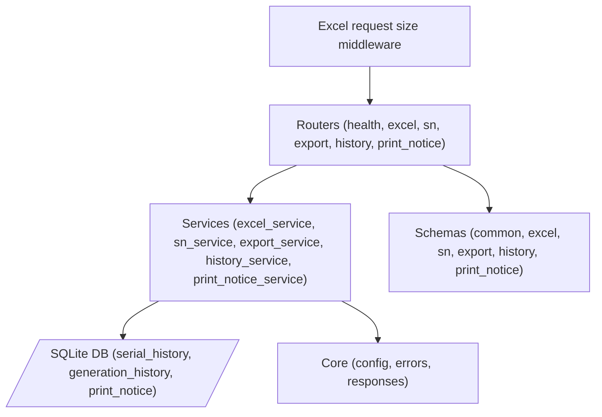

# SN-GENERATOR 後端代碼地圖 (Back-End Code Map)

**Version:** 0.3.41
**Last Updated:** 2026-09-09

---

## 1. 後端架構圖 (Architecture Diagram)

## 2. 檔案概覽 (File Overview)

| Path | Line Count | Description |
| :--- | :--- | :--- |
| `main.py` | - | App entry point and FastAPI setup |
| `api/routers/*` | - | Route definitions |
| `services/*` | - | Business logic implementations |
| `schemas/*` | - | Pydantic models for request/response validation |
| `core/*` | - | App configuration and error handling |

## 3. API 端點完整映射 (Complete API Endpoint Map)

除 `/api/health` 外，下列會執行 Excel、SQLite、檔案或同步匯出工作的 handler 均宣告為普通 `def`，由 FastAPI 自動排入 Thread Pool，避免凍結 Event Loop。`/api/health` 不執行 I/O，保留 `async def`。

| # | Method | Path | Handler | Request Schema | Response | Service Method |
| :--- | :--- | :--- | :--- | :--- | :--- | :--- |
| 1 | `GET` | `/api/health` | `health_check` | - | `dict` | - |
| 2 | `POST` | `/api/excel/parse` | `parse_excel` | `ParseRequest` | `ApiResponse` | `excel_service.parse` |
| 3 | `POST` | `/api/sn/generate` | `generate_sn` | `GenerateRequest` | `ApiResponse` | `sn_service.generate` |
| 4 | `POST` | `/api/export` | `export_excel` | `ExportRequest` | `FileResponse` | `export_service.export` |
| 5 | `GET` | `/api/history/entries` | `list_entries` | - | `ApiResponse` | `history_service.list_entries` |
| 6 | `GET` | `/api/history/last` | `get_last_serial` | `CustomerQuery` | `ApiResponse` | `history_service.get_last_serial` |
| 7 | `GET` | `/api/history/records` | `list_records` | - | `ApiResponse` | `history_service.list_generation_records` |
| 8 | `POST` | `/api/history/entry` | `upsert_entry` | `HistoryEntry` | `ApiResponse` | `history_service.upsert_entry` |
| 9 | `POST` | `/api/history/reset` | `reset_entry` | `ResetRequest` | `ApiResponse` | `history_service.reset_entry` |
| 10 | `GET` | `/api/print_notice` | `list_notices` | - | `ApiResponse` | `print_notice_service.list_entries` |
| 11 | `POST` | `/api/print_notice` | `upsert_notice` | `PrintNotice` | `ApiResponse` | `print_notice_service.upsert_entry` |
| 12 | `DELETE`| `/api/print_notice/{id}` | `delete_notice` | - | `ApiResponse` | `print_notice_service.delete_entry` |

## 4. 服務層詳情 (Service Layer Details)

### ExcelService (480 lines)
- **Class name:** `ExcelService`, **Singleton instance:** `excel_service`
- **Public methods:** `load_from_default_path`, `parse`
- **DB tables accessed:** -
- **Business logic summary:** Special handling includes HMG columnar parsing, BNG sanitization, and column alias resolution.

### SnService (125 lines)
- **Class name:** `SnService`, **Singleton instance:** `sn_service`
- **Public methods:** `generate` (with 6-customer dispatch)
- **DB tables accessed:** `serial_history`, `generation_history`
- **Business logic summary:**
  - yingbang: `{po}1{4-digit}`
  - lunfei: `106{WW}62{5-digit}`
  - others: accept external serials

### ExportService (92 lines)
- **Class name:** `ExportService`, **Singleton instance:** `export_service`
- **Public methods:** `export`
- **DB tables accessed:** -
- **Business logic summary:** Uses `EXPORT_HEADERS` config for each customer for dynamic workbook generation.

### HistoryService (208 lines)
- **Class name:** `HistoryService`, **Singleton instance:** `history_service`
- **Public methods:** `initialize`, `list_entries`, `get_last_serial`, `list_generation_records`, `upsert_entry`, `reset_entry`
- **DB tables accessed:** `serial_history`, `generation_history`
- **Business logic summary:** `increment > 0` 時以 SQLite `UPSERT ... RETURNING last_serial` 在單一 SQL 中建立或遞增計數器，並由回傳終點反推 `previous`；Process 內 Lock 僅作輔助，不再承擔跨 Worker 唯一性保證。

### PrintNoticeService (146 lines)
- **Class name:** `PrintNoticeService`, **Singleton instance:** `print_notice_service`
- **Public methods:** `initialize`, `list_entries`, `upsert_entry`, `delete_entry`
- **DB tables accessed:** `print_notice`
- **Business logic summary:** Manages printing notification data.

## 5. Schema 完整規格 (Schema Details)

Pydantic models definition with all fields and types inside `schemas/` folder mapping to endpoints.

## 6. 資料庫結構 (Database Schema)

3 tables implemented via SQLite:
- `serial_history`: Tracks the latest base serial for iteration.
- `generation_history`: Audit trail for generated outputs.
- `print_notice`: Temporary state for generated notices ready to print.

## 7. 組態設定 (Configuration)

Settings dataclass in `core/config.py`:
- `app_name`
- `api_prefix`
- `db_path`
- `allowed_customers`
- `cors_allowed_origins`（來源為 `CORS_ALLOWED_ORIGINS`；禁止 `*`）
- `max_excel_upload_bytes`（來源為 `MAX_EXCEL_UPLOAD_BYTES`；預設 20 MiB）
- `max_excel_uncompressed_bytes`（來源為 `MAX_EXCEL_UNCOMPRESSED_BYTES`；預設 100 MiB）
- `default_excel` paths

## 8. 錯誤處理 (Error Handling)

- Unified `ApiResponse` error format.
- Global exception handlers: `AppError`, `ValidationError`, `HTTPException`, `Exception`.
- 未預期例外對外僅回傳固定 `INTERNAL_ERROR`，完整 traceback 由 `logger.exception` 記錄。
- Complete error code list (18+ codes) mapping API logic exceptions to user-friendly messages.

## 9. 端到端資料流 (End-to-End Data Flows)

1. **Parse Excel:** `Client` -> `Router` -> `ExcelService` -> `Response`
2. **Generate SN:** `Client` -> `Router` -> `SnService` -> `HistoryService atomic range reservation` -> `DB` -> `SN formatting` -> `Response`
3. **Export Excel:** `Client` -> `Router` -> `ExportService` -> `Response`
4. **History management:** `Client` -> `Router` -> `HistoryService` -> `DB` -> `Response`
5. **Print notice management:** `Client` -> `Router` -> `PrintNoticeService` -> `DB` -> `Response`

## 10. 部署架構 (Deployment)

- **Dockerfile:** `python:3.12-slim`, `uvicorn`
- **docker-compose.yml:** `api` + `nginx` services
- **Setup:** Volume mounts for DB/Excels, network config for proxying.
- **CORS:** Docker 預設 `CORS_ALLOWED_ORIGINS=http://localhost:8080`；其他部署網域必須明確加入逗號分隔清單。

## 11. P0 回歸測試 (P0 Regression Tests)

- `backend/tests/test_p0_regressions.py`
- 以 4 個各自持有 Lock、共用同一 SQLite 檔的服務實例並行保留 40 個區間（每段 5 筆），驗證 200 個流水號唯一且連續。
- 驗證允許來源會取得 CORS response header、未列入來源不會取得，且 `CORS_ALLOWED_ORIGINS=*` 會被拒絕。

## 12. P1 穩定性回歸測試 (P1 Stability Tests)

- `backend/tests/test_p1_regressions.py`
- 驗證 Excel、匯出、History、SN、Print Notice 等 10 條同步 I/O 路由皆不是 coroutine handler，確保進入 FastAPI Thread Pool。
- 驗證純記憶體 `/api/health` 仍為 async handler。
- `backend/tests/test_p1_security_regressions.py` 驗證 500 資訊不外洩、宣告與實際 request/file 大小限制、XLSX 解壓總量限制及下載檔名控制字元清理。
