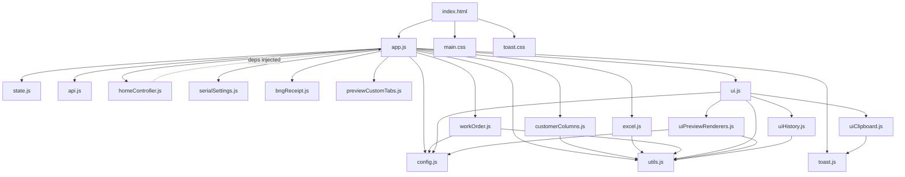

# SN-GENERATOR 前端代碼地圖 (Front-End Code Map)

**Version:** 0.3.79
**Last Updated:** 2026-09-18

---

## 1. 模組依賴圖 (Module Dependency Graph)

## 2. 檔案概覽 (File Overview)

| Filename | Description | Key Exports |
| :--- | :--- | :--- |
| `index.html` | Global config (`window.CUSTOMERS`), CDN libs, module entry and accessible search controls | - |
| `app.js` | Main coordinator, customer search/export flows and MO duplicate selection | - |
| `config.js` | CONFIG dynamic getter, customer key management, localStorage state | - |
| `state.js` | Global state object including MO match/selection state, `createUiRefs()` with DOM refs | - |
| `api.js` | API wrapper functions including models/months/refresh/sources (parse, generate, history, export, print-notice) | - |
| `excel.js` | Week calc, Datecode, Lunfei SN builder, BNG range expand, CHG bundle | - |
| `workOrder.js` | Work order tokenization, qty resolution, field search with fuzzy matching | - |
| `homeController.js` | Home aggregated search factory, dual-mode search, Toast and post-action scrolling | - |
| `masterDataMaintenance.js` | KOYA／NYX model and monthly-reference maintenance, enrichment and invalidation | `createMasterDataMaintenance` |
| `sourceMaintenance.js` | Shipment source CRUD, rule preview, refresh polling and maintenance visibility | `createSourceMaintenance` |
| `serialSettings.js` | CLG custom base serial (10/16/cycle_0_6/cycle_1_6) with BigInt | - |
| `bngReceipt.js` | BNG receipt payload builder + 190mm×55mm print HTML template | - |
| `previewCustomTabs.js` | Custom-tab controller: localStorage persistence, legacy HTML migration, add/remove/edit | `createPreviewCustomTabsController` |
| `ui.js` | UI aggregation entry, re-exports from clipboard/history/renderers + tab/status/custom-tab safe-edit bindings | - |
| `uiClipboard.js` | Dual-layer clipboard, delegated sheet-cell listener and global copy-success Toast | - |
| `toast.js` | Accessible success/error/info Toast creation, stacking and timed dismissal | `showToast` |
| `uiHistory.js` | History table renderer + reset button bindings | - |
| `uiPreviewRenderers.js` | Customer and generic-source renderers, BNG-style grouped cards, MO dual-preview and escaped custom tabs | - |
| `customerColumns.js` | Customer-specific column resolver with alias matching | - |
| `customers.js` | Validated `window.CUSTOMERS` registry、customer key/order constants | `CUSTOMER_KEYS`, `getCustomerRegistry` |
| `dom.js` | Controlled template parsing and DocumentFragment replacement boundary | `replaceChildrenFromTrustedTemplate` |
| `storage.js` | Observable localStorage and JSON adapter | read/write helpers, `setStorageErrorHandler` |
| `utils.js` | `normalizeText`, `escapeHtml`, `parseArrow`, `normalizeRangeText` | - |
| `styles/main.css` | Layout, themes, interaction/loading states, panels, tables, print styles, RWD | - |
| `styles/toast.css` | Fixed top-right Toast stack, entry/exit animation and mobile layout | - |

## 3. 狀態管理 (State Management)

### State Object
The global state object manages application lifecycle and data:
- `yingbangRowData`, `lunfeiRowData`, `bngRowData`, `chgRowData`, `hmgRowData`, `clgRowData`
- `hmgMatchedRows`, `clgMatchedRows`
- `moMatchedRows`, `moMatchCustomer`, `moMatchQuery`, `moSelectedIndex`
- `currentRow`, `currentQuery`, `generatedSNList`
- `printNoticeEntries`, `printHistoryCustomerFilter`
- `isLoading`

### homeRuntime
Handles home page search flow and logic:
- `customer`
- `query`
- `pendingModelCustomer`
- `pendingModelRows`

## 4. CONFIG 物件 (Configuration)

Dynamic getter properties based on current customer context:
- `SHEET_NAME`
- `STORAGE_KEY`
- `GENERATION_HISTORY_KEY`
- `COLUMNS`
- `COLUMN_ALIASES`

## 5. 客戶系統 (Customer System)

| Key | Label | SheetName | Parse Rules | Serial Rule | Export Strategy |
| :--- | :--- | :--- | :--- |
| `yingbang` | 營邦 | 營邦出貨 | arrow | `{po}1{4-digit}` | 單表 Excel |
| `lunfei` | 倫飛 | 倫飛出貨 | arrow | `106{WW}62{5-digit}` | SN + BOX |
| `bng` | 超恩 | 超恩出貨 | trim | MAC/SN/UUID 區間 | SN + BOX／收據 |
| `chg` | KOYA | KOYA出貨 | trim | 按數量展開 Label | SN + BOX |
| `hmg` | 赫星 | 組測序號編碼 | trim／欄式解析 | 無 SN | HEX |
| `clg` | Cubepilot | 板階序號編碼 | none | 手動進制序號 | MES／文字檔 |

**Customer Profile Properties List:** Defines mapping and rule constants per customer.
**Customer Switching Mechanism:** `switchCustomerTab` flow handles dynamic configuration reloading and UI re-rendering based on customer context.

## 6. UI 架構 (UI Architecture)

- **Home layout:** left sidebar (print notice board) + main area (search bar + preview pane)
- **Legacy customer workspaces:** hidden, used as compatibility layer
- **Preview pane tabs:** Preview / Sheet Content / History / Custom tabs；可編輯自訂頁籤使用 `contenteditable="plaintext-only"`，另以 paste/drop handler 封鎖 HTML 插入。
- **Print notice board:** with date-grouped cards

## 7. 核心資料流 (Data Flows)

1. **Upload Excel (shared 4-customer + independent hmg/clg):**
   `UI Event` -> `Function` -> `API Call` -> `State Update` -> `UI Render`
2. **Search work order (home aggregated search with dual mode):**
   `UI Event` -> `Function` -> `API Call` -> `State Update` -> `UI Render`
   - Lunfei／BNG 的 MO 恰好命中 2 筆時，渲染兩張摘要卡；點選卡片後更新 `moSelectedIndex` 與 `currentRow`，再重繪完整預覽。
   - 首頁選取會同步客戶工作區預覽，後續生成、匯出及 BNG 收據以目前選取列為準。
3. **Generate SN & Export:**
   `UI Event` -> `Function` -> `API Call` -> `State Update` -> `UI Render`
4. **History management:**
   `UI Event` -> `Function` -> `API Call` -> `State Update` -> `UI Render`
5. **BNG receipt printing:**
   `UI Event` -> `Function` -> `API Call` -> `State Update` -> `UI Render`
6. **Custom tabs CRUD:**
   `UI Event` -> `Plain-text normalization` -> `extraPreviewTabs` -> `localStorage (sn_preview_custom_tabs)` -> `escaped UI Render`

   啟動時 `hydrateEditableCustomerCustomTabs()` 會把舊版 `html/contentHtml` 透過 inert `DOMParser` 轉為文字，移除 HTML 欄位後覆寫 localStorage；`uiPreviewRenderers.js` 渲染前仍會執行 `escapeHtml()`，形成儲存與輸出兩層防護。

## 8. 事件綁定總覽 (Event Bindings)

Major event bindings from `initEvents()` in `app.js` categorized by:
- **file upload:** Excel import buttons
- **search:** Text inputs, enter key press
- **MO duplicate selection:** delegated click handling on home, Lunfei and BNG preview roots
- **export:** SN generation, file downloads
- **history:** Data grid, refresh, filtering
- **tabs:** Navigation interactions
- **custom tabs:** Addition, deletion, plain-text paste/drop filtering, updating
- **print:** Triggering browser print dialog for receipts/notices
- **settings:** Configuration application and modal toggling
- **shortcuts:** Enter 查詢、首頁搜尋框 `Ctrl+Enter` 匯出、`Escape` 收合序號設定並還原焦點

## 9. 效能與模組化狀態 (Performance and Modularization Status)

- `bindSheetCopyCellsIn()` 在每個預覽 root 僅註冊一次 `click` listener，透過 `closest('.copyable-cell')` 處理目前及後續動態產生的所有儲存格；重複 bind 不會增加 listener。
- 自訂頁籤已移至 `previewCustomTabs.js`；KOYA／NYX 主檔與月份維護移至 `masterDataMaintenance.js`；來源 CRUD、規則預覽及更新輪詢移至 `sourceMaintenance.js`。
- `app.js` 仍包含多客戶查詢與匯出協調，後續拆分工作持續列於 T69。

## 10. CSS 架構與響應式規則

- `id` 僅供 JavaScript DOM 定位；`main.css` 使用 `.status-message`、`.home-search-type`、`.home-theme-surface` 等語意 class，降低特異性並便於元件覆寫。
- 六客戶主題 class 只設定 `--home-theme-accent`，共用 surface 與 status 規則統一讀取該變數，不再為每個客戶複製相同宣告。
- 版面寬高、間距、字級與 mobile breakpoint 使用 `rem`；只在 1px/2px 邊線、outline、inset shadow 與 999px 膠囊圓角保留像素值。
- `js/tests/p1_regression.mjs` 會阻止 ID selector、重複主題結構及新的固定版面 px 值回歸。
- `.duplicate-mo-options` 在桌面採雙欄、行動版改為單欄；`.duplicate-hit` 與 `.duplicate-hit-message` 固定使用紅色粗體，優先於首頁客戶主題色。
- 按鈕統一具備至少 `2.5rem` 觸擊高度、hover/active/focus-visible 回饋；非同步搜尋與匯出透過 `.btn-loading` + `aria-busy` 呈現處理中狀態。
- `.collapsible-panel` 為設定／歷史面板提供進出場效果；所有動畫與平滑捲動均在 `prefers-reduced-motion` 下安全降級。
- 搜尋輸入使用 `type="search"`、`autofocus`、`autocomplete="off"` 與 `spellcheck="false"`，並保留瀏覽器原生清除按鈕。

## 11. 初始化、儲存與安全渲染

- `customers.js` 集中定義六客戶 key，並在模組初始化時驗證 `window.CUSTOMERS` 完整性；其他模組不直接讀取該全域。
- `createUiRefs()` 對必要 DOM 執行 fail-fast 檢查，錯誤會列出缺少的 ref 名稱。
- `storage.js` 將 localStorage 權限、配額及 JSON 損壞錯誤回報給首頁狀態列；handler 尚未註冊時會暫存錯誤，註冊後補送。
- Lunfei、BNG、CHG 成功預覽共用 `renderCustomerSearchSuccessLayout()`；所有功能模組與 `app.js` 動態模板均透過 `dom.js` 的 DocumentFragment boundary 更新。
- 首頁預覽同步使用 `cloneChildrenInto()` 複製既有 DOM 節點，不再讀取及重新解析 `innerHTML`；檔名與例外訊息在放入模板前先以文字語境 encoder 處理。
- `escapeHtml()` 僅用於 HTML 文字，動態屬性改用 `escapeHtmlAttribute()`；兩者都不得用於 script、style 或 URL 語境。

## 12. 全域操作回饋

- `toast.js` 動態建立 `aria-live="polite"` 容器，success/info 使用 `role="status"`，error 使用 `role="alert"`；同時最多保留 5 則，預設 3 秒後移除。
- `homeController.js` 在首頁搜尋成功、未命中或例外時發送 Toast，完成渲染後將預覽 panel 捲入視野。
- `uiClipboard.js` 統一處理按鈕與表格儲存格的複製成功 Toast；失敗仍交由客戶狀態列並顯示 error Toast。
- `onExportClick()` 回傳布林結果，首頁只在真實匯出成功時顯示完成，避免底層失敗被誤報為成功。

## 2026-09-14 現況同步

- 出貨更新：首頁「更新資料」啟動背景合併程式，每秒輪詢進度，成功後重新載入總表；最後更新時間取自檔案 mtime，以台北時間顯示。
- 合併來源包含營邦、倫飛、超恩、KOYA、富弘年、勤誠；富弘年由通用來源載入首頁搜尋／完整預覽且停用序號歷史與匯出，勤誠命中後提供專用面板。
- KOYA 型號保存 Model／PN／full PN；NYX 保存 Model／PN。PO／LOT 分別由月份對照維護；NYX 目前只有主檔維護，未接入出貨查詢與匯出。
- 資料來源設定保存於 SQLite，支援九個來源的路徑及適用的工作表、檔名關鍵字、回溯檔案數；重設恢復當前環境變數或程式預設值。
- 後端服務由 FastAPI lifespan 初始化並透過 Depends 注入；Customer Enum、ApiResponse[T]、輸入上限、JSON logging、WAL 與 SQLite 交易已實作。
- Docker 資料庫掛載為 /app/data；網路磁碟掛載為 /mnt/netdisk。Linux systemd 提供獨立資料目錄與資料庫備份／修復腳本。
- 本次同步依據目前工作樹（包含未提交及新增檔案），不代表已部署。主檔與來源維護已從 app.js 抽離；多客戶查詢／匯出協調及 Docker 非 root 使用者仍待完成。

### 維護面板與更新控制器

- `app.js`：`enrichKoyaShipmentRows()` 對原始 `chgSourceRowData` 套用主檔与月份對照；完整 Model 比對優先，XXXX 表示族群前綴。修改或刪除 KOYA 主檔／月份後清除舊查詢選取，避免沿用過期預覽。
- `loadKoyaModelEntries()`／`loadNyxModelEntries()` 及對應 submit/table handlers 執行型號 CRUD；`getMonthlyReferenceUi()` 共用兩個月份表的 CRUD，`ensureMonthlyReferencesFromKoyaRows()` 只補缺少月份。
- `state.js` 新增 `chgSourceRowData`、`koyaModelEntries`、`nyxModelEntries`、`koyaMonthEntries`、`nyxMonthEntries`、`shipmentSourceEntries` 與必要 DOM refs。
- `api.js` 新增型號、月份、更新狀態／啟動及來源 list/update/reset wrappers；來源 key 與月份 customer 在 URL 中編碼。
- `renderShipmentRefreshStatus()` 更新 progress、百分比、階段、訊息與檔案時間；`syncShipmentRefreshStatus()` 每秒輪詢，成功後 `autoRestoreExcelData()`，失敗顯示錯誤與 Toast。
- `loadShipmentSourceEntries()` 在首次展開來源面板時讀取設定；依來源種類顯示適用規則欄位，儲存及重設後重新載入。路徑是後端可存取路徑，不是瀏覽器本機檔案選擇。
- 首頁維護入口可用快捷鍵切換顯示；Escape 收合維護面板並還原焦點，參見 `initEvents()`。預覽頁籤提供 tablist／tab／tabpanel、aria-selected、aria-controls 與鍵盤導覽。
- `styles/main.css` 補上型號／月份／來源維護表單、更新進度、首頁排版及窄螢幕樣式；Toast 仍由 `styles/toast.css` 管理。

### 超恩 BIOS/FW 分享連結（2026-09-14 現況）

`GET /api/vecow-link` 讀取、`PUT /api/vecow-link` 儲存 `{ "url": "https://…" }`；空白移除，最長 2000 字元，只接受無帳密的有效 HTTP(S) 網址。`VecowLinkService` 使用 SQLite `vecow_link` 單列（id=1），lifespan 初始化後由 router 從 app.state 取得。`js/modules/vecowLink.js` 管理維護表單、載入與連結顯示；首頁僅命中超恩時顯示，超恩工作區亦有入口，未設定時隱藏，新頁開啟使用 noopener noreferrer。此分享網址獨立於合併器 BIOS Excel 檔案路徑。維護入口以 Ctrl+Shift+D 切換顯示。

## v0.3.61 現況補充（2026-09-14）

本次以目前未提交工作樹核對，保留之前的修改紀錄。新增泉影 DEG 獨立生成面板、三種編碼規格、日期帶入、整批複製、Excel 下載與生成歷史；新增深色／淺色／彩色外觀選擇。後端允許七個 customer（原六客戶加 deg），前端 CUSTOMERS registry 與聚合搜尋仍為原六客戶，DEG 由獨立面板操作；NYX 仍僅提供主檔與月份維護。API 仍為 27 組 Method／Path，資料庫仍為八個表，DEG 重用 SN／export／history API 與既有歷史表。

### DEG、外觀與靜態資源

`index.html` 的 deg-generator-card 使用原生 details；`js/modules/deg.js` 匯出 getDegTodayValues／initDegGenerator，重用 api.js 的生成、歷史與下載函式。面板提供規格選擇、產品碼 datalist、日期、週別、起號與數量，並依規格隱藏及停用不適用輸入；預覽 textarea 為唯讀。下載檔名為泉影DEG-SN.xlsx，複製使用 Clipboard API，錯誤在 deg-status 顯示。

日期計算保留日曆年＋ISO 週別；輸入變動清除已生成結果，操作使用 busy／inert 防重複。歷史由 API 讀取，使用 textContent 建立紀錄節點。四張 M.2 對照圖在 assets/deg，使用 lazy loading。

主題選擇器位於頁首，state.js 快取 themeSelect；app.js 的 applyTheme 更新 data-theme，change handler 寫入 sn-color-theme，預設深色。CSS 分別提供 dark／colorful 覆寫，light 使用基礎樣式。app.js 資源快取參數目前為 v0.3.61，main.css 為 v0.3.58。

前端新增 js/tests/deg_regression.mjs（當日值、跨年與週日）及 vecow_link_regression.mjs（超恩連結顯示／維護）。DEG 未納入六客戶 registry、首頁聚合搜尋或 uiPreviewRenderers。

## v0.3.79 工作樹現況（2026-09-18）

本版文件依目前未提交工作樹同步。現況包含可配置來源規則五階段、自訂來源建立與預覽、舊客戶比較遷移、DEG 編碼、勤誠 FZG 客序／MAC，以及富弘年 `dcg` 首頁搜尋。所有通用來源在更新總表後自動加入首頁工單／MO 搜尋，並使用超恩式摘要、分類卡片、預覽／原始資料頁籤與複製操作，不需新增客戶分支。前端已將主檔維護與來源維護分別抽至 `masterDataMaintenance.js`、`sourceMaintenance.js`。後端 Customer Enum 為 8 個值；現行 API 共 32 組 Method／Path，SQLite 共 8 張表。

部署邊界：`deploy/shipment-release.json` 現為 0.3.79，本機執行 `shipment_check.py --check` 回傳 `errors: []`，清單內檔案雜湊、MIME、模組與來源設定檢查通過。此結果僅代表目前工作區自檢通過；本機未連線正式網路磁碟，亦未驗證正式伺服器部署、服務帳號權限或真實客戶資料比較。

驗證狀態（2026-09-18）：`npm test` 的 7 組前端回歸全部通過（含 Playwright 來源規則瀏覽器流程）；後端完整測試為 `114 passed`；74 個 Python 檔語法解析通過；部署清單自檢無錯誤。

### v0.3.79 前端模組

- `sourceRulesEditor.js`：有限選項表單，編輯基本與進階匯入規則、重排規則及組成結構化 payload；不接受任意 JSON／程式碼。
- `sourcePreview.js`：渲染未保存規則的檔案／表頭／映射／前後樣本，以及背景更新逐來源結果與遷移狀態。
- `sourceSearch.js`：通用來源精確 token／包含搜尋與客戶關鍵字來源篩選；`homeController.js` 整合自訂來源、富弘年、DEG 與勤誠命中，並阻止通用／DEG 誤用原六客戶匯出。所有通用來源命中後沿用超恩的摘要、分類卡片、預覽／原始資料頁籤及逐欄複製結構。
- `masterDataMaintenance.js`：集中 KOYA／NYX Model 與月份 CRUD、KOYA 出貨補值及異動後查詢失效處理。
- `sourceMaintenance.js`：集中資料來源表單、候選規則、預覽、背景更新進度與維護入口顯示。
- `fzgSerial.js`：命中勤誠後帶入料號與數量，生成客序或 MAC、複製、查看剩餘量及確認後重設。
- `api.js`：新增來源 preview/create、load-source 以及 FZG status/reset wrappers。

資料來源維護現在可新增自訂來源、指定通用或 DEG 搜尋用途、客戶關鍵字、搜尋欄名，並預覽、保存及更新。所有自訂來源及內建富弘年在載入總表後進入 `state.customSourceData`，自動取得首頁搜尋與超恩式渲染；同來源多筆結果在原始資料頁籤顯示完整欄位。內建四個候選來源可勾選共用規則；超恩與 KOYA 只顯示特殊規則摘要。

目前入口快取參數為 app.js／main.css v0.3.79；內部模組依各自修訂使用 v0.3.70～0.3.79。這些參數不是可分批部署授權；正式機必須依 0.3.79 release manifest 同批核對。

## 0.3.79 文件同步狀態

本文件已於 2026-09-18 依目前工作樹核對；細節以對應階段規格與原始碼為準。工作樹完成不代表正式機已部署。
