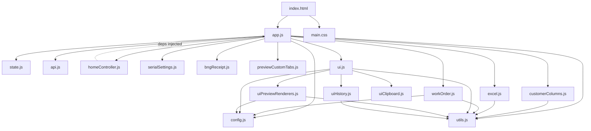

# SN-GENERATOR 前端代碼地圖 (Front-End Code Map)

**Version:** 0.3.39
**Last Updated:** 2026-09-09

---

## 1. 模組依賴圖 (Module Dependency Graph)

## 2. 檔案概覽 (File Overview)

| Filename | Size | Line Count | Description | Key Exports |
| :--- | :--- | :--- | :--- | :--- |
| `index.html` | 26KB | - | Global config (`window.CUSTOMERS`), CDN libs, module entry | - |
| `app.js` | 109KB | 3355 | Main controller, event bindings and customer flows | - |
| `config.js` | 2KB | - | CONFIG dynamic getter, customer key management, localStorage state | - |
| `state.js` | 7KB | 121 | Global state object (12 properties), `createUiRefs()` with 65 DOM refs | - |
| `api.js` | 4KB | 160 | 10 API wrapper functions (parse, generate, history, export, print-notice) | - |
| `excel.js` | 11KB | - | Week calc, Datecode, Lunfei SN builder, BNG range expand, CHG bundle | - |
| `workOrder.js` | 5KB | - | Work order tokenization, qty resolution, field search with fuzzy matching | - |
| `homeController.js` | 18KB | - | Home aggregated search factory (`createHomeController`), dual mode search | - |
| `serialSettings.js` | 5KB | - | CLG custom base serial (10/16/cycle_0_6/cycle_1_6) with BigInt | - |
| `bngReceipt.js` | 4KB | - | BNG receipt payload builder + 190mm×55mm print HTML template | - |
| `previewCustomTabs.js` | 7KB | 212 | Custom-tab controller: localStorage persistence, legacy HTML migration, add/remove/edit | `createPreviewCustomTabsController` |
| `ui.js` | 7KB | 197 | UI aggregation entry, re-exports from clipboard/history/renderers + tab/status/custom-tab safe-edit bindings | - |
| `uiClipboard.js` | 4KB | - | Dual-layer clipboard; sheet cells use one delegated root listener instead of per-cell listeners | - |
| `uiHistory.js` | 2KB | - | History table renderer + reset button bindings | - |
| `uiPreviewRenderers.js` | 32KB | 914 | 6-customer preview renderers, escaped custom-tab rendering and legacy HTML-to-text conversion | - |
| `customerColumns.js` | 1KB | - | Customer-specific column resolver with alias matching | - |
| `utils.js` | 1KB | - | `normalizeText`, `escapeHtml`, `parseArrow`, `normalizeRangeText` | - |
| `styles/main.css` | 20KB | - | Layout, themes, tables, cards, tabs, print styles, RWD | - |

## 3. 狀態管理 (State Management)

### State Object
The global state object manages application lifecycle and data:
- `yingbangRowData`, `lunfeiRowData`, `bngRowData`, `chgRowData`, `hmgRowData`, `clgRowData`
- `hmgMatchedRows`, `clgMatchedRows`
- `currentRow`, `currentQuery`, `generatedSNList`
- `printNoticeEntries`, `printHistoryCustomerFilter`
- `isLoading`

### homeRuntime
Handles home page search flow and logic:
- `customer`
- `query`
- `pendingModelCustomer`
- `pendingModelRows`

## 4. CONFIG 物件 (Configuration)

Dynamic getter properties based on current customer context:
- `SHEET_NAME`
- `STORAGE_KEY`
- `GENERATION_HISTORY_KEY`
- `COLUMNS`
- `COLUMN_ALIASES`

## 5. 客戶系統 (Customer System)

| Key | Label | SheetName | Parse Rules | Serial Rule | Export Strategy |
| :--- | :--- | :--- | :--- | :--- | :--- |
| `yingbang` | 迎邦 | 迎邦 | - | `{po}1{4-digit}` | standard |
| `lunfei` | 倫飛 | 倫飛 | - | `106{WW}62{5-digit}` | standard |
| `bng` | BNG | BNG | - | external | standard |
| `chg` | CHG | CHG | - | external | standard |
| `hmg` | HMG | HMG | columnar | external | standard |
| `clg` | CLG | CLG | - | base serial | standard |

**Customer Profile Properties List:** Defines mapping and rule constants per customer.
**Customer Switching Mechanism:** `switchCustomerTab` flow handles dynamic configuration reloading and UI re-rendering based on customer context.

## 6. UI 架構 (UI Architecture)

- **Home layout:** left sidebar (print notice board) + main area (search bar + preview pane)
- **Legacy customer workspaces:** hidden, used as compatibility layer
- **Preview pane tabs:** Preview / Sheet Content / History / Custom tabs；可編輯自訂頁籤使用 `contenteditable="plaintext-only"`，另以 paste/drop handler 封鎖 HTML 插入。
- **Print notice board:** with date-grouped cards

## 7. 核心資料流 (Data Flows)

1. **Upload Excel (shared 4-customer + independent hmg/clg):**
   `UI Event` -> `Function` -> `API Call` -> `State Update` -> `UI Render`
2. **Search work order (home aggregated search with dual mode):**
   `UI Event` -> `Function` -> `API Call` -> `State Update` -> `UI Render`
3. **Generate SN & Export:**
   `UI Event` -> `Function` -> `API Call` -> `State Update` -> `UI Render`
4. **History management:**
   `UI Event` -> `Function` -> `API Call` -> `State Update` -> `UI Render`
5. **BNG receipt printing:**
   `UI Event` -> `Function` -> `API Call` -> `State Update` -> `UI Render`
6. **Custom tabs CRUD:**
   `UI Event` -> `Plain-text normalization` -> `extraPreviewTabs` -> `localStorage (sn_preview_custom_tabs)` -> `escaped UI Render`

   啟動時 `hydrateEditableCustomerCustomTabs()` 會把舊版 `html/contentHtml` 透過 inert `DOMParser` 轉為文字，移除 HTML 欄位後覆寫 localStorage；`uiPreviewRenderers.js` 渲染前仍會執行 `escapeHtml()`，形成儲存與輸出兩層防護。

## 8. 事件綁定總覽 (Event Bindings)

Major event bindings from `initEvents()` in `app.js` categorized by:
- **file upload:** Excel import buttons
- **search:** Text inputs, enter key press
- **export:** SN generation, file downloads
- **history:** Data grid, refresh, filtering
- **tabs:** Navigation interactions
- **custom tabs:** Addition, deletion, plain-text paste/drop filtering, updating
- **print:** Triggering browser print dialog for receipts/notices
- **settings:** Configuration application and modal toggling

## 9. 效能與模組化狀態 (Performance and Modularization Status)

- `bindSheetCopyCellsIn()` 在每個預覽 root 僅註冊一次 `click` listener，透過 `closest('.copyable-cell')` 處理目前及後續動態產生的所有儲存格；重複 bind 不會增加 listener。
- 自訂頁籤的 localStorage、HTML-to-text 遷移、索引解析與 CRUD 已從 `app.js` 移至 `previewCustomTabs.js`，主檔由 3,571 行降至 3,355 行。
- `app.js` 仍包含多客戶流程與匯出協調，後續拆分工作持續列於 T69，不視為完全結案。
